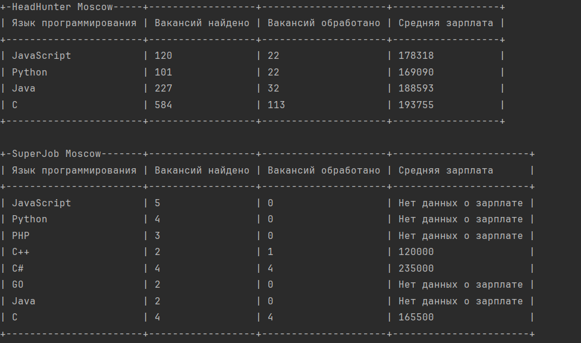

# Сравниваем вакансии программистов
Позволяет увидеть количество вакансий, а также среднюю зарплату по языкам программировани взятых с сайтов hh.ru и superjob.ru
## Как установить


  - ***Операционная система:***  
    - Windows 10 или новее
    - macOS 10.14 или новее
    - Linux (разные дистрибутивы)

  - ***Язык программирования:***  
    - Python 3.6 или новее


  ## Установка окружения


  1. Создайте виртуальное окружение:
        ```bash
        python -m venv venv
        ```

  3. Активируйте виртуальное окружение:
   
    - На Windows:
      ```bash
      venv\Scripts\activate
      ```
    - На macOS/Linux:
        ```bash
        source venv/bin/activate
        ```

  4. Установите зависимости:
    ```bash
       pip install -r requirements.txt
    ```
  5. В файле .env есть `SECRET_KEY` его можно получить на [https://api.superjob.ru](https://api.superjob.ru) зарегистрировав свое приложение без этого данный с сайта [https://superjob.ru](https://superjob.ru) не будет 
  5. Запускаем файл main.py
  ```python main.py```
  6. Пример вывода 
 

## Цель проекта
  - Код написан в образовательных целях на онлайн-курсе для веб-разработчиков dvmn.org.


 